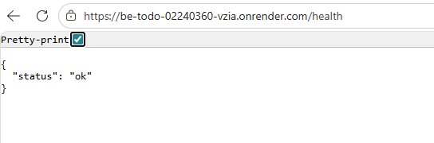
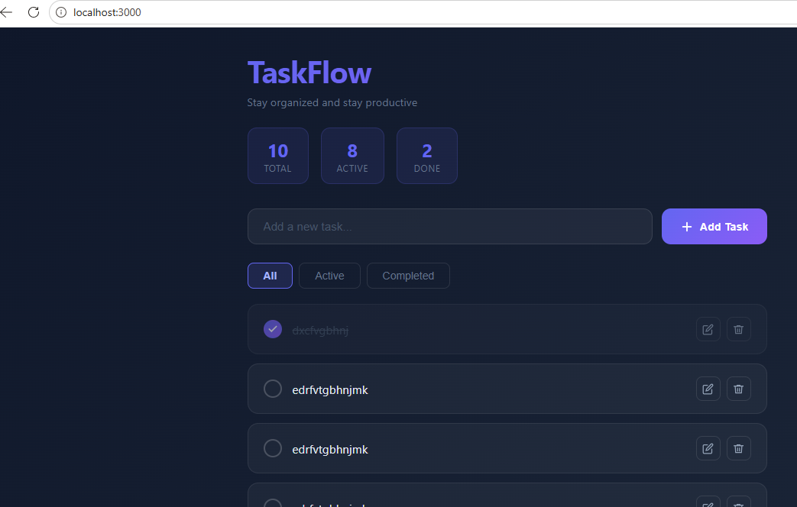
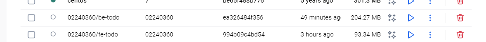
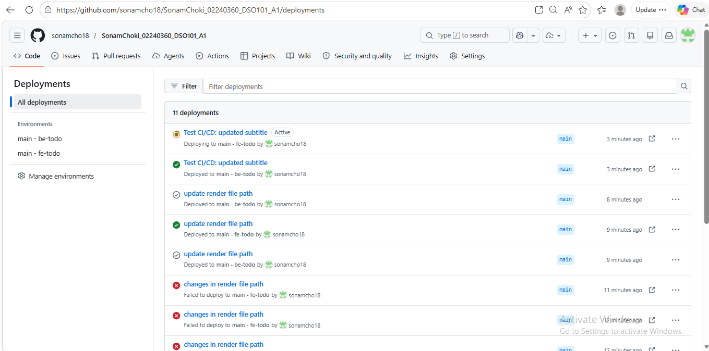
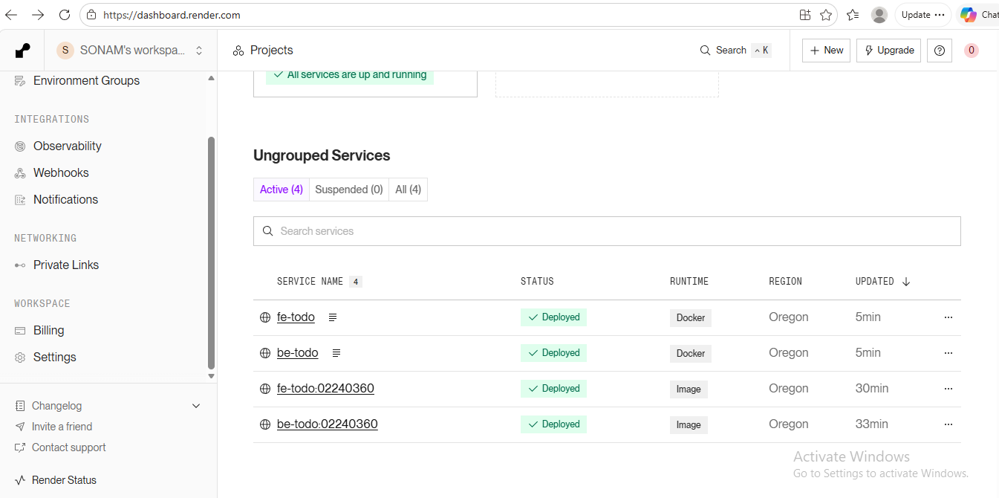
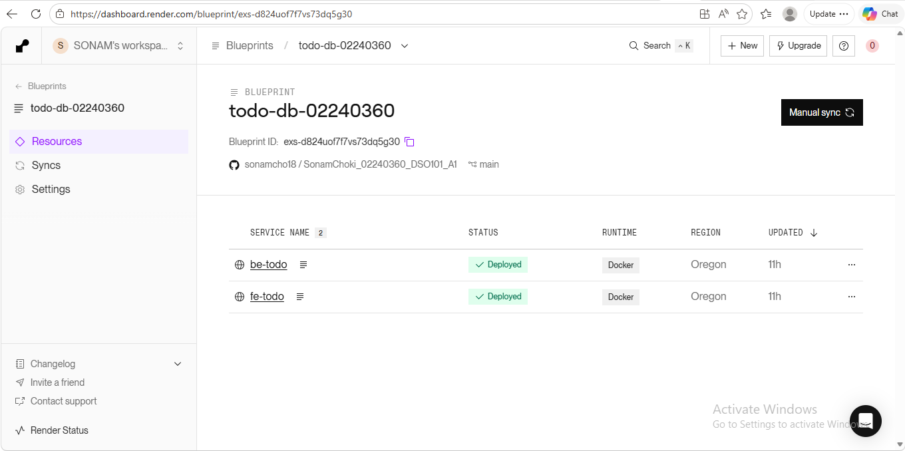
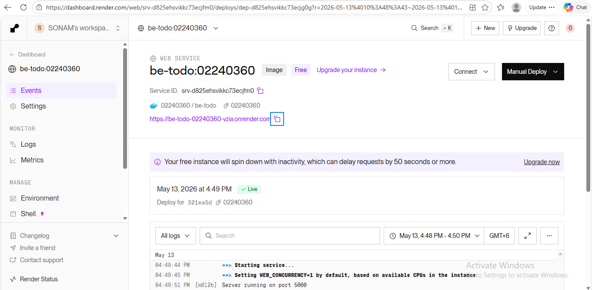
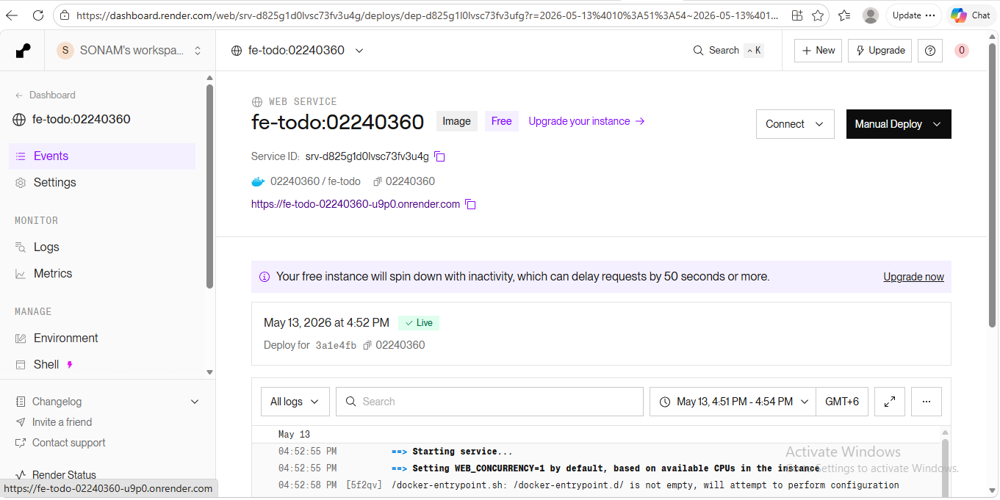

# Assignment 1 Report — TaskFlow (CI/CD)
## GitHub Repository
https://github.com/sonamcho18/SonamChoki_02240360_DSO101_A1.git

## Introduction

TaskFlow is a full-stack To-Do List web application with a React frontend, Node.js/Express backend, and PostgreSQL database. It is containerized with Docker and deployed on Render with CI/CD using GitHub and a Render Blueprint.

---

## Steps 
### Backend local setup

### Frontend local setup

### Push images to Docker Hub

### Push code to GitHub

### Blueprint CI/CD on Render

### Render dashboard showing the frontend (fe-do) and backend (be-do) services

---

## Conclusion

This project successfully delivered a containerized full-stack To-Do application with a React frontend and Node.js/Express backend, deployed to Render using Docker images and automated CI/CD via GitHub and a Render Blueprint. All required services (frontend, backend, and database) were deployed and verified through live URLs, backend health checks, and deployment dashboards.

