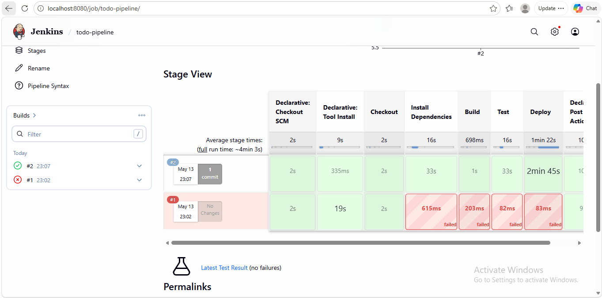
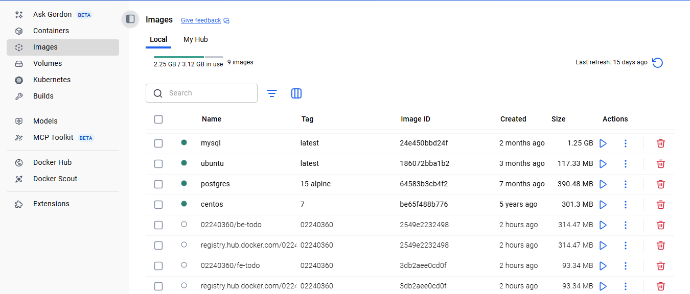
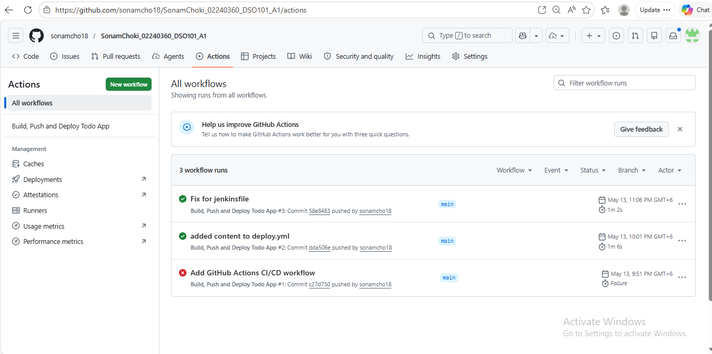

## GitHub Repository
https://github.com/sonamcho18/SonamChoki_02240360_DSO101_A1.git

## Objective

Configure a Jenkins pipeline to automate the build, test, and deployment of the To-Do List application from Assignment 1. The pipeline includes code checkout, dependency installation, build, unit testing with Jest, and Docker deployment.

## Pipeline Configuration

### How I Configured the Pipeline

- Installed Jenkins on localhost:8080 using the Windows installer from jenkins.io
- Installed required plugins: NodeJS Plugin, Pipeline, GitHub Integration, Docker Pipeline
- Configured Node.js v20 in Manage Jenkins 
- Added GitHub Personal Access Token as credentials in Jenkins
- Added Docker Hub credentials in Jenkins 
- Created a new Pipeline job pointing to this GitHub repository
- Set Script Path to jenkinsfile
- The pipeline auto-triggers on every push to the main branch

## Screenshots

### Test Results in Jenkins

### Docker Hub Images

### Github Image

## Relevant Resources

- Jenkins Documentation: https://www.jenkins.io/doc/
- Jest Documentation: https://jestjs.io/docs/getting-started
- Docker Documentation: https://docs.docker.com/
