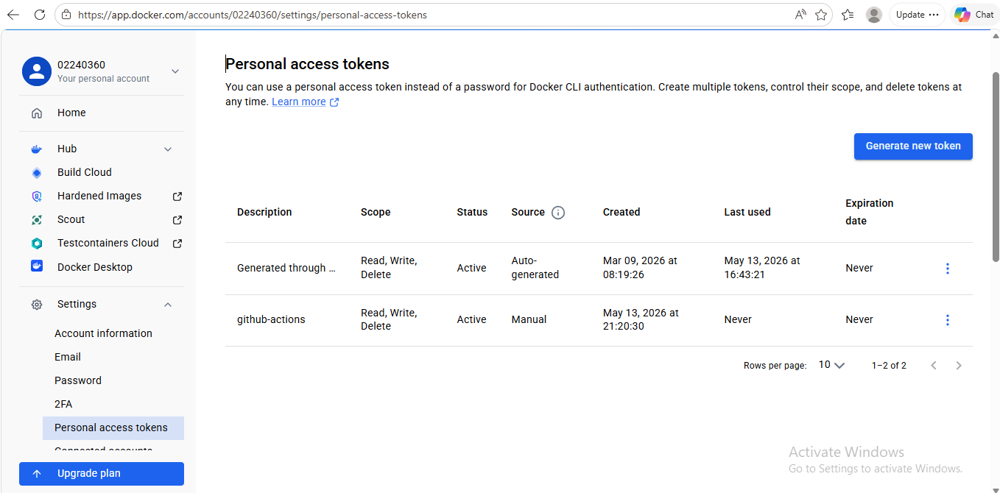
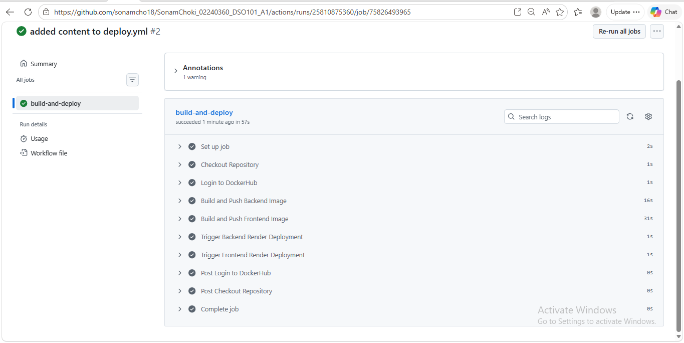

## GitHub Repository
https://github.com/sonamcho18/SonamChoki_02240360_DSO101_A1.git

## 1. Introduction

This assignment demonstrates a CI/CD flow for the todo app using GitHub Actions, Docker Hub, and Render. It highlights the automated build and push of images, and the deployment of both backend and frontend services.

## 2. Screenshots

Successful GitHub Actions workflow:

DockerHub pushed the image:

Render.com deployment:

## 3. Short Report

Render deployment links:
- Backend: https://be-todo-w6ew.onrender.com
- Frontend: https://fe-todo-845u.onrender.com

Docker Hub image links:
- https://hub.docker.com/r/02240360/fe-todo
- https://hub.docker.com/r/02240360/be-todo

## 4. Conclusion

The workflow successfully automated image publishing and verified the deployed services on Render. This setup reinforces best practices for consistent delivery and deployment of containerized applications.
